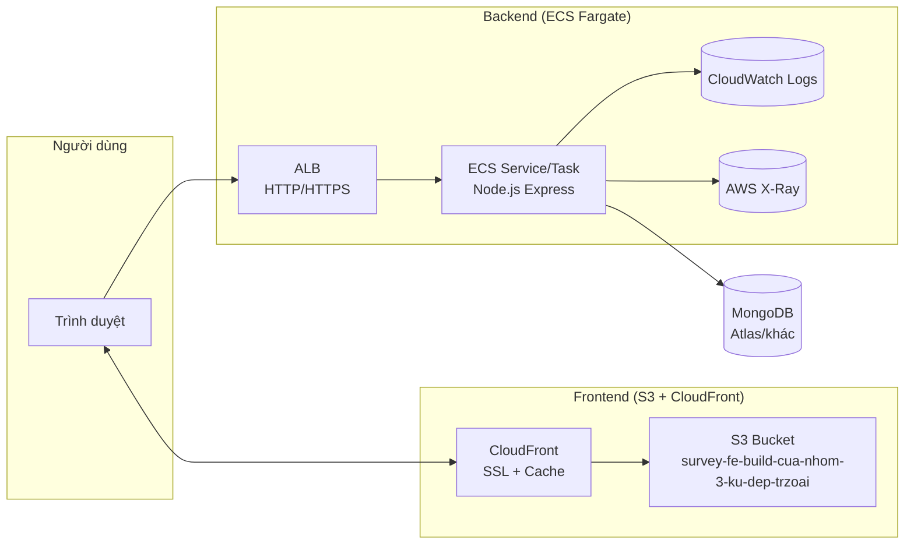
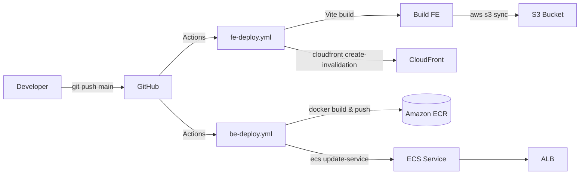

# SurveyApp - Ứng dụng Khảo sát Trực tuyến 📊

SurveyApp là một dự án **full-stack** được xây dựng nhằm cung cấp một nền tảng hoàn chỉnh để tạo, quản lý, tham gia và phân tích các cuộc khảo sát trực tuyến. Ứng dụng được phát triển với kiến trúc client-server riêng biệt, đảm bảo khả năng mở rộng và bảo trì dễ dàng.

  * **Backend:** Được xây dựng bằng **Node.js, Express và MongoDB**, cung cấp một API RESTful mạnh mẽ để xử lý logic nghiệp vụ, xác thực người dùng qua JWT, quản lý dữ liệu khảo sát và thống kê kết quả.
  * **Frontend:** Được xây dựng bằng **React + Vite**, mang lại trải nghiệm người dùng hiện đại, nhanh chóng và tương tác cao. Giao diện được thiết kế để người dùng có thể dễ dàng tạo khảo sát, tham gia trả lời và xem kết quả được trực quan hóa.
  * **Deployment:** AWS (S3, CloudFront, ECS, ALB), Docker, GitHub Actions
-----

# 📁Link Web Demo:
 http://survey-fe-build-cua-nhom-3-ku-dep-trzoai.s3-website-ap-southeast-1.amazonaws.com/

##  Kiến trúc AWS (High level)



###  CI/CD pipeline


## ✨ Tính năng nổi bật

  * **👨‍💻 Quản lý Tài khoản:**

      * Đăng ký, đăng nhập an toàn cho người dùng.
      * Xác thực và phân quyền bằng **JSON Web Tokens (JWT)**.

  * **📝 Trình tạo Khảo sát Trực quan:**

      * Tạo, chỉnh sửa và xóa khảo sát một cách dễ dàng.
      * Hỗ trợ nhiều loại câu hỏi khác nhau (trắc nghiệm, tự luận, thang đo,...).
      * Quản lý danh sách các khảo sát đã tạo.

  * **🙋‍♂️ Tham gia Khảo sát:**

      * Người dùng có thể tham gia trả lời khảo sát thông qua một đường dẫn duy nhất.
      * Hỗ trợ cả người dùng đã đăng nhập và người dùng ẩn danh.

  * **📈 Phân tích & Thống kê Kết quả:**

      * Xem kết quả tổng hợp của mỗi cuộc khảo sát.
      * Dữ liệu được trực quan hóa bằng các biểu đồ (biểu đồ cột) giúp dễ dàng nắm bắt thông tin.

-----

## 🛠️ Công nghệ sử dụng

  * **Backend:**
      * **Nền tảng:** Node.js
      * **Framework:** Express.js
      * **Cơ sở dữ liệu:** MongoDB với Mongoose ODM
      * **Xác thực:** JSON Web Token (JWT)
  * **Frontend:**
      * **Thư viện:** React.js
      * **Build Tool:** Vite
      * **Styling:** CSS Modules / Tailwind CSS (tùy chọn)
      * **Routing:** React Router
      * **Quản lý State:** Context API / Redux Toolkit (tùy chọn)

-----

## 🚀 Hướng dẫn Cài đặt & Khởi chạy

### Yêu cầu chung

  * **Node.js** phiên bản `18.x` trở lên.
  * **npm** hoặc **yarn**.
  * **MongoDB** đã được cài đặt và đang chạy trên máy hoặc sử dụng một dịch vụ cloud như MongoDB Atlas.

### 1\. Cài đặt Backend (`survey-be`)

```bash
# Di chuyển vào thư mục backend
cd survey-be

# Cài đặt các gói phụ thuộc
npm install
```

**Cấu hình biến môi trường:** Tạo một file tên là `.env` trong thư mục `survey-be` và điền các thông tin cần thiết.

**.env**

```env
# Chuỗi kết nối tới MongoDB
MONGODB_URI=mongodb://localhost:2717/surveyapp

# Khóa bí mật để ký JWT, hãy thay bằng một chuỗi ngẫu nhiên và phức tạp
JWT_SECRET=your_super_secret_key_123

# Domain của frontend để cho phép CORS
ALLOW_ORIGIN=http://localhost:5173
```

**Chạy server Backend:**

```bash
# Chạy ở chế độ development (với nodemon)
npm run dev
```

> ✅ API server sẽ khởi chạy tại `http://localhost:3000` (hoặc cổng bạn cấu hình).

### 2\. Cài đặt Frontend (`survey-fe`)

```bash
# (Từ thư mục gốc) Di chuyển vào thư mục frontend
cd survey-fe

# Cài đặt các gói phụ thuộc
npm install
```

**Chạy ứng dụng Frontend:**

```bash
# Khởi chạy server development
npm run dev
```

> ✅ Mở trình duyệt và truy cập vào `http://localhost:5173` để sử dụng ứng dụng.

-----

## 📁 Cấu trúc thư mục

```
Lab3_QLDAPM_SurveyApp/
│
├── survey-be/         # Backend (Node.js, Express, MongoDB)
│   ├── src/
│   │   ├── controllers/ # Chứa logic xử lý request
│   │   ├── middlewares/ # Chứa các middleware (VD: xác thực token)
│   │   ├── models/      # Định nghĩa Schema cho MongoDB
│   │   ├── routes/      # Định tuyến các API endpoint
│   │   ├── db.js        # Cấu hình kết nối database
│   │   └── index.js     # Điểm khởi đầu của ứng dụng
│   ├── .env             # Biến môi trường (không commit)
│   ├── server.js
│   └── package.json
│
├── survey-fe/         # Frontend (React, Vite)
│   ├── src/
│   │   ├── pages/       # Các trang chính của ứng dụng
│   │   ├── components/  # Các thành phần UI tái sử dụng
│   │   ├── state/       # Quản lý state (Context, Redux)
│   │   ├── utils/       # Các hàm tiện ích
│   │   └── main.jsx     # Điểm khởi đầu của React app
│   ├── public/          # Chứa các file tĩnh
│   ├── index.html
│   └── package.json
│
└── README.md
```

-----

## 📦 Build & Triển khai Production

  * **Frontend:**
    Chạy lệnh sau để build phiên bản tối ưu cho production:

    ```bash
    cd survey-fe
    npm run build
    ```

    Toàn bộ các file tĩnh sẽ được tạo ra trong thư mục `dist/`. Bạn có thể triển khai thư mục này lên các dịch vụ hosting tĩnh AWS S3.

  * **Backend:**
    Backend có thể được triển khai như một ứng dụng Node.js thông thường lên các nền tảng như AWS EC2, đóng gói bằng Docker để triển khai trên các dịch vụ container.

-----

## 🤝 Đóng góp

Mọi ý kiến đóng góp, báo lỗi hoặc đề xuất tính năng mới đều được hoan nghênh. Vui lòng tạo một **Issue** để mô tả vấn đề hoặc một **Pull Request** nếu bạn muốn đóng góp mã nguồn.

1.  **Fork** a project.
2.  Tạo một nhánh mới (`git checkout -b feature/AmazingFeature`).
3.  Commit các thay đổi của bạn (`git commit -m 'Add some AmazingFeature'`).
4.  Đẩy lên nhánh (`git push origin feature/AmazingFeature`).
5.  Mở một **Pull Request**.